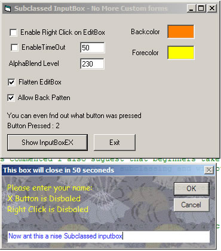



## Subclassed InputBoxFX

### Description

Ever wanted to added custom bitmaps to an inputbox, or add your own fonts, colors, well now you can. with this new Subclassed inputbox you can chnage background color, texture, AlphaBlending, Disable right click in the edit box, disable the inputbox's X Close button, add a Self Closeing Timer and much more. note this is all done with the normal inputbox and a API. Hope you like it please vote.
 
### More Info
 

             |
---                |---
**Submitted On**   |2002-03-01 14:53:58
**By**             |[dreamvb](https://github.com/Planet-Source-Code/PSCIndex/blob/master/ByAuthor/dreamvb.md)
**Level**          |Intermediate
**User Rating**    |5.0 (40 globes from 8 users)
**Compatibility**  |VB 5\.0, VB 6\.0
**Category**       |[Windows API Call/ Explanation](https://github.com/Planet-Source-Code/PSCIndex/blob/master/ByCategory/windows-api-call-explanation__1-39.md)
**World**          |[Visual Basic](https://github.com/Planet-Source-Code/PSCIndex/blob/master/ByWorld/visual-basic.md)
**Archive File**   |[Subclassed1932239132005\.zip](https://github.com/Planet-Source-Code/dreamvb-subclassed-inputboxfx__1-62548/archive/master.zip)

